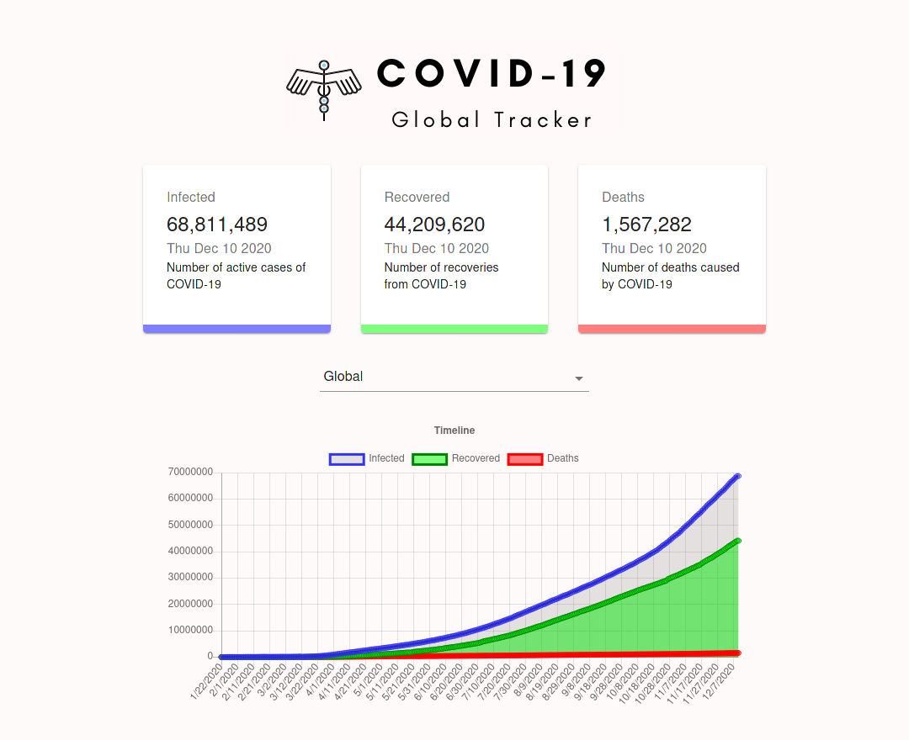

# COVID-19 Global Tracker

Link: https://covid19-globaltracker.firebaseapp.com/

## Description

This is a web app that tracks daily statistics of the COVID-19 Pandemic. Data is displayed for individual countries as well as the world in total.

Built using ReactJS, ChartsJS, axios, and Material UI. Deployed using Firebase.
## Credits
API used: https://covid19-api.org/

Inspiration: @adrianhajdin
